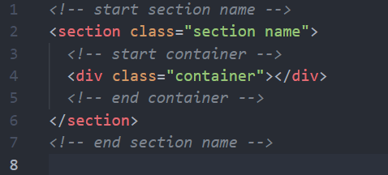
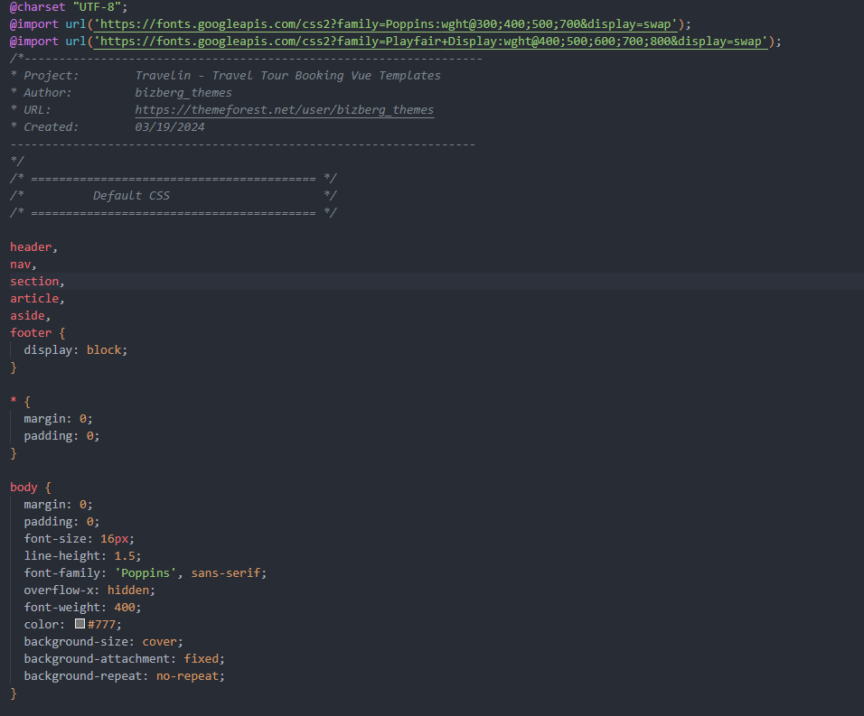

# Code Structure

In the section, we'll discuss about the code structure of HTML, CSS, and JavaScript which were followed in the project.

## HTML

The project follows HTML structure based on Bootstrap that helps you rapidly develop web pages that look beautiful at any size, be it a laptop screen or mobile devices.

Every section of a page follows above HTML pattern for consistency.

Feel free to extend or modify these HTML structure in anyway you want according to your project needs.

## CSS

The project CSS also follows a pattern of defining base style for HTML elements, overriding Bootstrap CSS, creating custom CSS, using fonts, etc.

::: info Info
You might wonder why all CSS rules are kept in `style.css` file. The reason is that the project, [Travelin](https://htmldesigntemplates.com/html/travelin/), already exists in pure HTML, CSS, and JavaScript form. The Vue version of this project is based on original [Travelin](https://htmldesigntemplates.com/html/travelin/) project meaning all HTML and CSS are simply copied into this project to maintain consistency between two different projects.
:::

## JavaScript

The project follows coding pattern that aligns with the Vue pattern of writing code to achieve desired output. This means using Composition API, which is the latest Vue 3 feature, along with TypeScript.

The project is entirely written in TypeScript that compiles to efficient JavaScript code. You don't have to worry about this as it is all handled by Vue and Vite
automatically.
